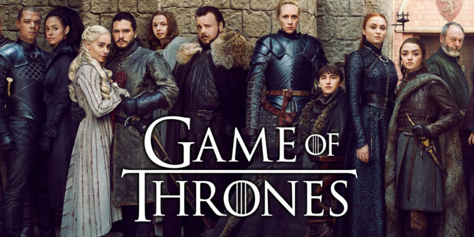
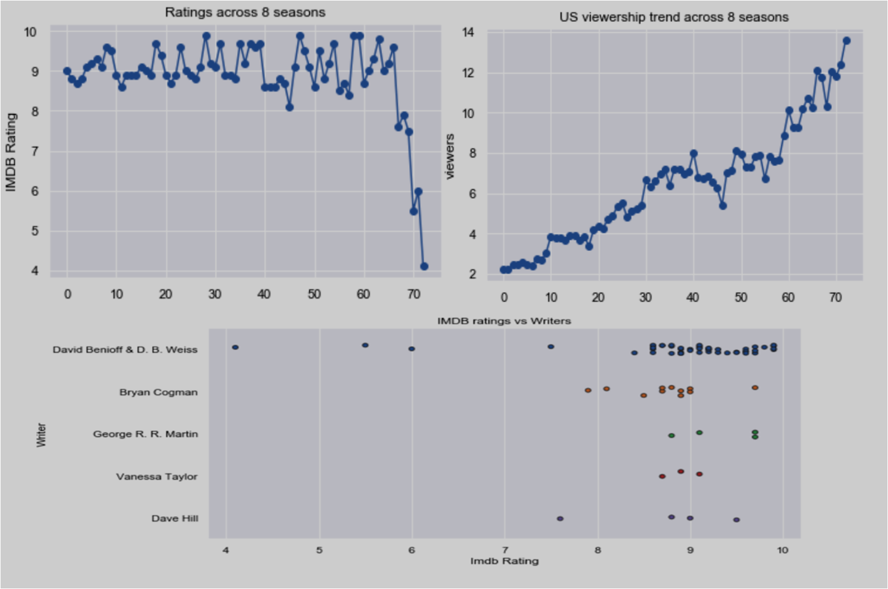
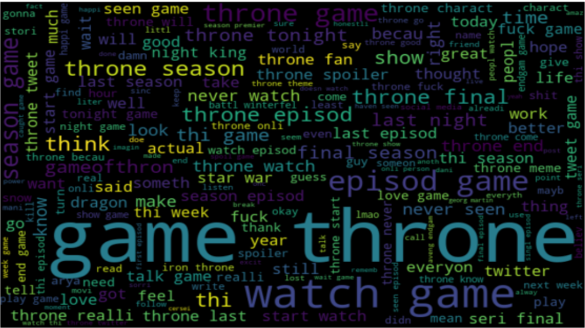
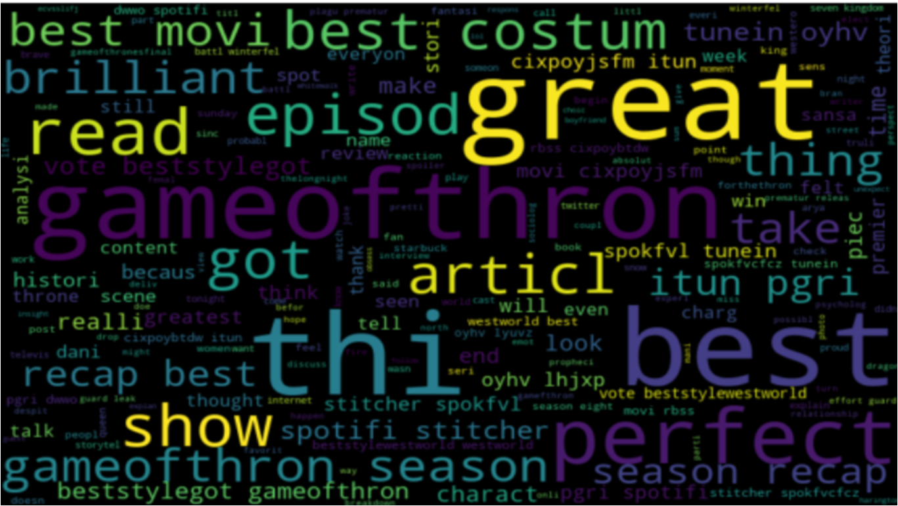
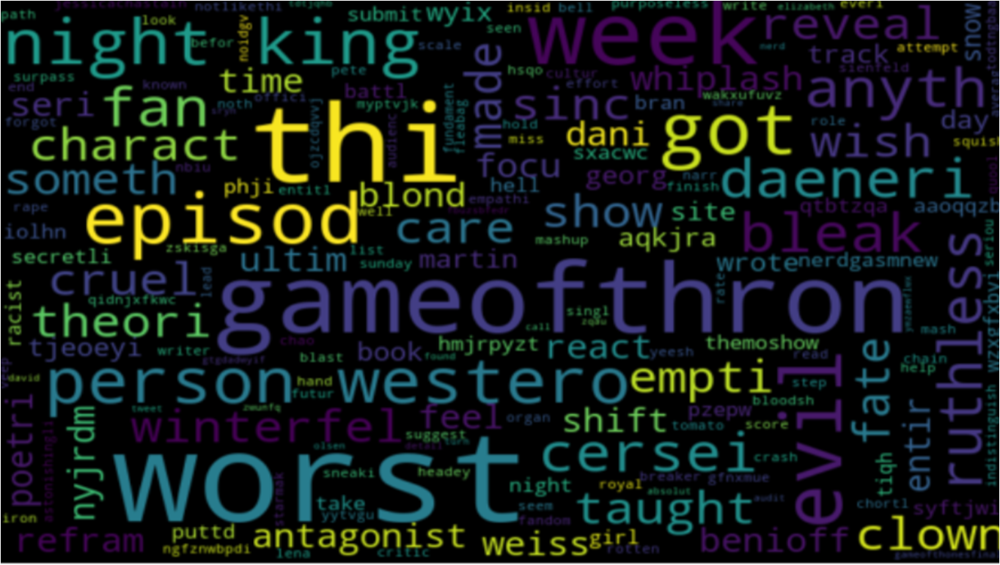
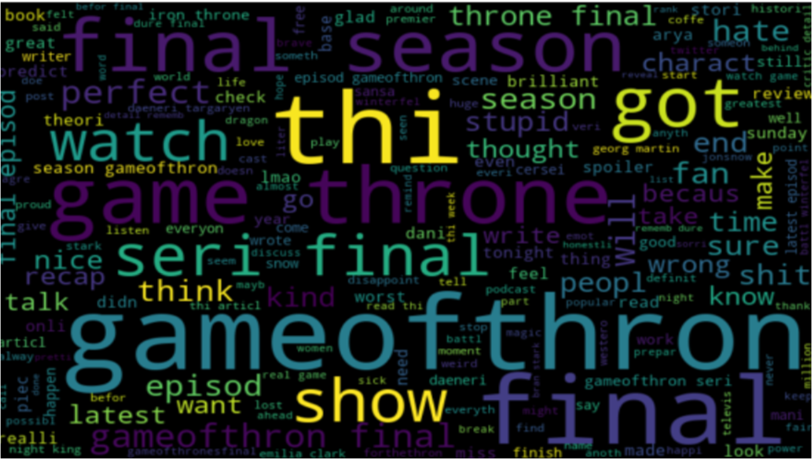

# NLP with Game of Thrones
#### Thirumurugan Ramar
             

### Game of Thrones is a hit fantasy tv show based on the equally famous book series "A Song of Fire and Ice" by George RR Martin. The show is well known for its vastly complicated political landscape, large number of characters, and its frequent character deaths.It's one of my favourite tv shows.I had a lot of fun while doing this project!

## Part 1: Exploratory data Analysis:
Game of Thrones is one of the world's most popular TV shows, so why not let you explore information about it. Is there are link between ratings and viewer figures? Do certain writers and directors make better episodes? AND MANY MORE:)
Visualizations are available in the EDA notebook.

### Screenshots of some visualizations:

### Part 2: Twitter Sentiment Analysis of got season 8:
This dataset was downloaded from kaggle.This dataset captures the release of all six Game of Thrones episodes from the eighth season that premiered on 14th of April, 2019. Sentiments of tweets which had more than 10k favourites was analysed.

### Results:
#### Overall positive tweet%  = 22.5
#### Overall negative tweets% = 77.5

### Wordcloud for full data:

### Wordcloud for Positive tweets:

### Wordcloud for Negative tweets:

### Wordcloud for Subjective tweets:

# I thank HODOR for HOLDING THE DOOR :)

